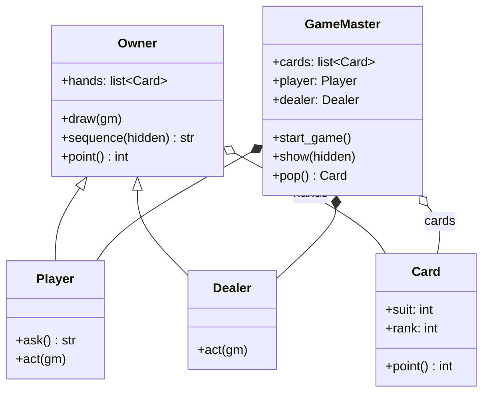

# Python

## クラス図

```mermaid
classDiagram
    class Card {
        +suit: int
        +rank: int
        +point() int
    }
    class Owner {
        +hands: list~Card~
        +draw(gm)
        +sequence(hidden) str
        +point() int
    }
    class Player {
        +ask() str
        +act(gm)
    }
    class Dealer {
        +act(gm)
    }
    class GameMaster {
        +cards: list~Card~
        +player: Player
        +dealer: Dealer
        +start_game()
        +show(hidden)
        +pop() Card
    }
    Owner <|-- Player
    Owner <|-- Dealer
    Owner o-- Card : hands
    GameMaster o-- Card : cards
    GameMaster *-- Player
    GameMaster *-- Dealer
```

## API

::: src.blackjackpy
